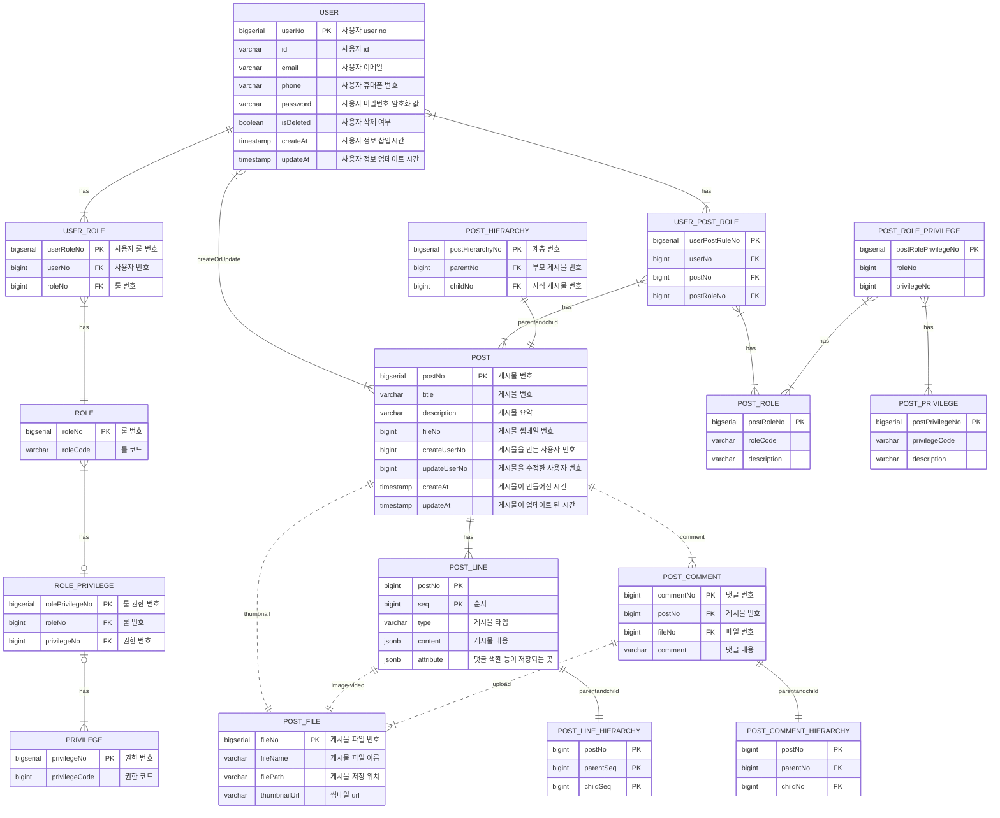

# 게시판 ERD

```mermaid
erDiagram
	USER {
		bigserial userNo PK "사용자 user no"
		varchar id "사용자 id"
		varchar email "사용자 이메일"
		varchar phone "사용자 휴대폰 번호"
		varchar password "사용자 비밀번호 암호화 값"
		boolean isDeleted "사용자 삭제 여부"
		timestamp createAt "사용자 정보 삽입시간"
		timestamp updateAt "사용자 정보 업데이트 시간"
	}
	
	USER_ROLE {
		bigserial userRoleNo PK "사용자 룰 번호"
		bigint userNo FK "사용자 번호"
		bigint roleNo FK "룰 번호"
	}
	
	ROLE {
		bigserial roleNo PK "룰 번호"
		varchar roleCode "룰 코드"
	}
	
	ROLE_PRIVILEGE {
		bigserial rolePrivilegeNo PK "룰 권한 번호"
		bigint roleNo FK "룰 번호"
		bigint privilegeNo FK "권한 번호"
	}
	
	PRIVILEGE {
		bigserial privilegeNo PK "권한 번호"
		bigint privilegeCode "권한 코드"
	}
	
	POST {
		bigserial postNo PK "게시물 번호"
		varchar title "게시물 번호"
		varchar description "게시물 요약"
		bigint fileNo "게시물 썸네일 번호"
		bigint createUserNo "게시물을 만든 사용자 번호"
		bigint updateUserNo "게시물을 수정한 사용자 번호"
		timestamp createAt "게시물이 만들어진 시간"
		timestamp updateAt "게시물이 업데이트 된 시간"
	}
	
	POST_HIERARCHY {
		bigserial postHierarchyNo PK "계층 번호"
		bigint parentNo FK "부모 게시물 번호"
		bigint childNo FK "자식 게시물 번호"
	}
	
	POST_LINE {
		bigint postNo PK
		bigint seq PK "순서"
		varchar type "게시물 타입"
		jsonb content "게시물 내용"
		jsonb attribute "댓글 색깔 등이 저장되는 곳"
	}
	
	POST_LINE_HIERARCHY {
		bigint postNo PK
		bigint parentSeq PK
		bigint childSeq PK
	}
	
	POST_FILE {
		bigserial fileNo PK "게시물 파일 번호"
		varchar fileName "게시물 파일 이름"
		varchar filePath "게시물 저장 위치"
		varchar thumbnailUrl "썸네일 url"
	}
	
	POST_COMMENT {
		bigint commentNo PK "댓글 번호"
		bigint postNo FK "게시물 번호"
		bigint fileNo FK "파일 번호"
		varchar comment "댓글 내용"
	}
	
	POST_COMMENT_HIERARCHY {
		bigint postNo PK
		bigint parentNo FK
		bigint childNo FK
	}
	
	USER_POST_ROLE {
		bigserial userPostRuleNo PK ""
		bigint userNo FK ""
		bigint postNo FK ""
		bigint postRoleNo FK ""
	}
	
	POST_ROLE {
		bigserial postRoleNo PK ""
		varchar roleCode ""
		varchar description ""
	}
	
	POST_ROLE_PRIVILEGE {
		bigserial postRolePrivilegeNo PK ""
		bigint roleNo ""
		bigint privilegeNo ""
	}
	
	POST_PRIVILEGE {
		bigserial postPrivilegeNo PK ""
		varchar privilegeCode ""
		varchar description ""
	}
	
	USER ||--|{ USER_ROLE : has
	USER_ROLE }|--|| ROLE : has
	ROLE }|--|O ROLE_PRIVILEGE : has
	ROLE_PRIVILEGE O|--|{ PRIVILEGE : has
	
	USER }|--|{ POST : createOrUpdate
	POST ||--|{ POST_LINE : has
	
	USER }|--|{ USER_POST_ROLE : has
	USER_POST_ROLE }|--|{ POST : has
	
	USER_POST_ROLE }|--|{ POST_ROLE : has
	POST_ROLE_PRIVILEGE }|--|{ POST_ROLE : has
	POST_ROLE_PRIVILEGE }|--|{ POST_PRIVILEGE : has
	
	POST ||..|| POST_FILE : thumbnail
	POST_LINE ||..|| POST_FILE : image-video
	
	POST ||..|{ POST_COMMENT : comment
	POST_COMMENT ||..|{ POST_FILE : upload
	
	POST_HIERARCHY ||--|| POST : parentandchild
	POST_LINE ||--|| POST_LINE_HIERARCHY : parentandchild
	POST_COMMENT ||--|| POST_COMMENT_HIERARCHY : parentandchild
	
```

